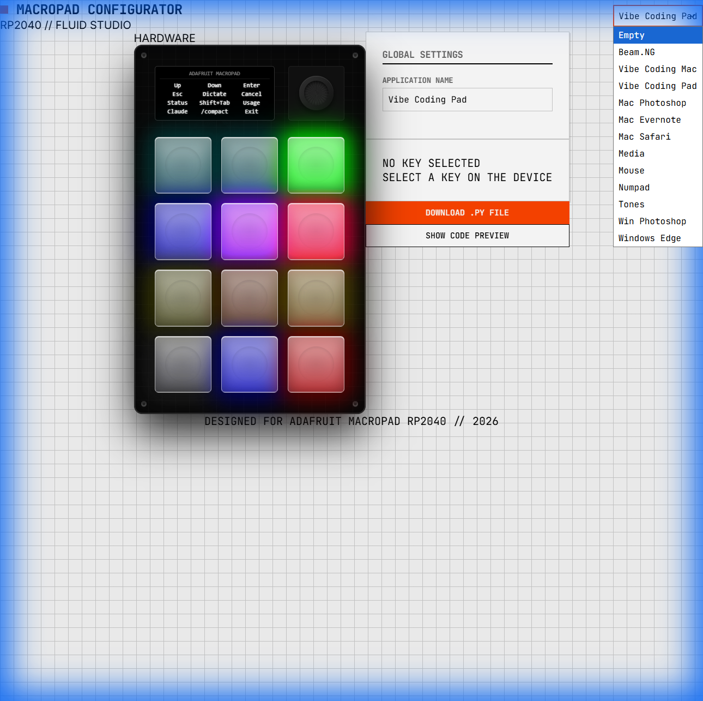

# Adafruit MacroPad Configurator

A premium, interactive web-based tool for configuring the **Adafruit MacroPad RP2040**.  
Easily design your key layouts, set LED colors, and generate the CircuitPython code needed to power your device.

## 🚀 Try it Live

**[Launch the Configurator →](https://macropad.apps.drayne.xyz/)**



---


## Features

*   **Live Visual Preview**:
    *   **OLED Screen**: Updates instantly as you type labels.
    *   **RGB LEDs**: Visualizes color settings with realistic "clear plastic" keycap diffusion and transparent "off" states.
    *   **Realistic Layout**: Matches the physical hardware (Screen & Encoder on top, 12 keys below).
*   **Drag-and-Drop / Click Flow**:
    *   Select any key to edit its properties.
    *   Assign specific hex colors to each key.
    *   Define macro sequences (Key presses, Media controls, Text, Delays).
*   **Smart Presets**:
    *   Load built-in examples (Media, Numpad) to get started instantly.
*   **Code Generation**:
    *   Automatically generates the valid `app` dictionary Python code required by the MacroPad.

## Getting Started

 This project uses **Vite + React**.

1.  **Clone the repository**:
    ```bash
    git clone https://github.com/ddrayne/macropad-configurator.git
    cd macropad-configurator
    ```

2.  **Navigate to the app directory**:
    ```bash
    cd configurator
    ```

3.  **Install dependencies**:
    ```bash
    npm install
    ```

4.  **Run the development server**:
    ```bash
    npm run dev
    ```

5.  Open your browser to `http://localhost:5173` (or the port shown in your terminal).

## Documentation

For details on the original python firmware, macro formats, and hardware specifics, check the **[docs](docs/)** folder:

*   [Macro Information & Firmware Guide](docs/macro-information.md) (Original README)
*   [Agent Guide](docs/AGENT_GUIDE.md)

## Tech Stack

*   **Framework**: React (Vite)
*   **Styling**: Vanilla CSS (CSS Variables, Grid, Flexbox)
*   **Visuals**: Custom CSS-only hardware simulation (Frosted glass effects, LED glow, PCB textures).
